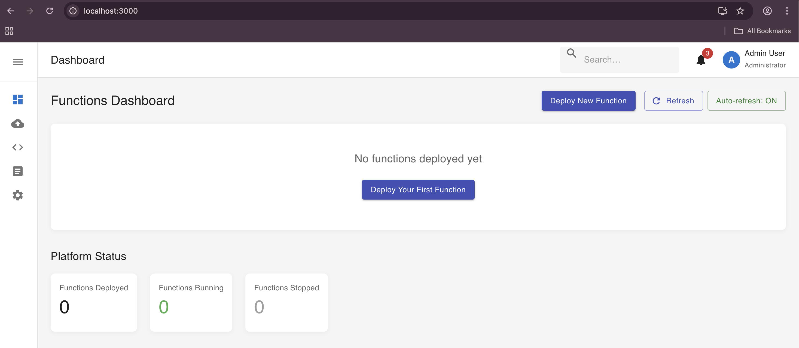
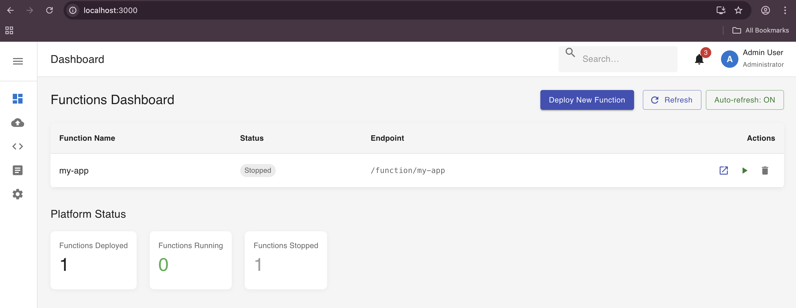
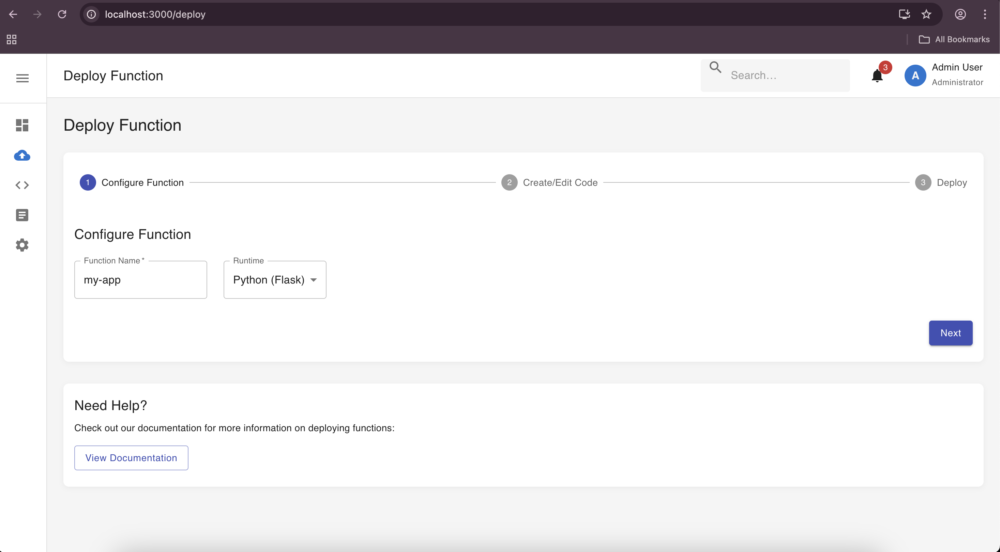
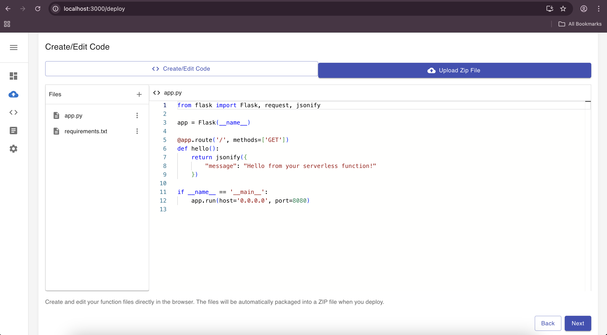
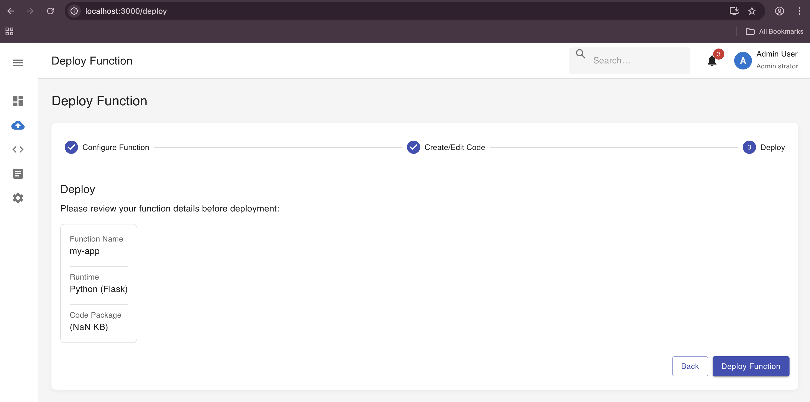
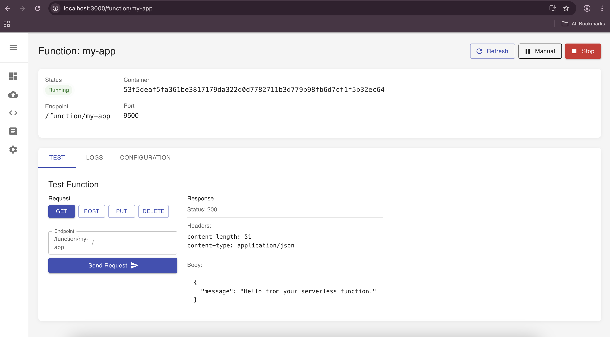
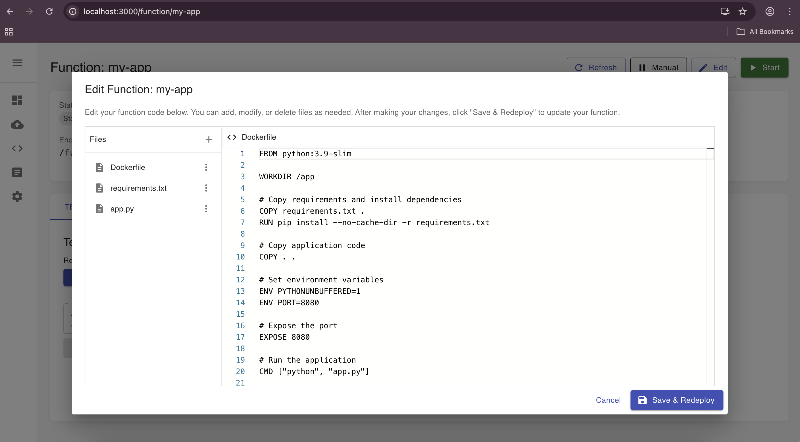

# Web UI Walkthrough

This guide will walk you through using the Web UI to deploy, manage, and monitor serverless functions on the platform.

---

## 1. Starting the Platform

From the project root, run:

```sh
docker compose up --build
```

Wait for all services to start (you should see logs indicating the UI, API gateway, function controller, etc. are running).

---

## 2. Accessing the Web Dashboard

Open your browser and go to:

```
http://localhost:3000
```

(Or the port specified in your `docker-compose.yaml`.)

You should see the Serverless Platform dashboard.


*The main dashboard view when you first open the Web UI.*


*Dashboard after deploying a function, showing function status and actions.*

---

## 3. Overview of the Dashboard

- **Function List / Dashboard:**See all deployed functions, their current status (Running/Stopped), and available actions.
- **Deploy New Function:**Upload new function code and specify runtime (e.g., Python Flask, Node.js).
- **Function Actions:**
  - **Start/Stop:** Start or stop containers for each function.
  - **Invoke:** Trigger the function and view the result.
  - **Edit/Redeploy:** Upload new code to update a function.
  - **Delete:** Remove a function and its container.

---

## 4. Deploying a New Function

1. Click on the “Deploy Function” or “Add Function” button.
2. Fill in the required details:
   - Function name
   - Select runtime (e.g., Python Flask)
   - Upload your function code (usually as a zip or source file)
3. Click “Deploy.”
4. The dashboard will show build and deployment progress. Once complete, the function appears in the list.

### Deploying a Function (Step-by-Step)


*Step 1: Open the deploy function dialog and fill in the function details.*


*Step 2: Upload your code and select the runtime.*


*Step 3: Confirm and deploy. Progress will be shown.*

---

## 5. Managing Functions

- **Start/Stop:**Click the Start or Stop button to control the function’s container. The status chip will animate or change color to indicate running/stopped states.
- **Invoke:**Use the “Invoke” button to test your function. The response will be displayed in the UI.
- **Edit/Redeploy:**Click “Edit” or “Redeploy,” upload new code, and confirm. The platform will rebuild and restart the function container.
- **Delete:**
  Use the “Delete” button to remove the function. **You must click the delete button twice to confirm deletion.** This will stop and remove its container.


*Invoking a function and viewing the result directly in the UI.*



---

## 6. Real-Time Feedback & Status

- The UI provides real-time status updates (with pulsing/animated indicators for running functions).
- Actions are reflected immediately (optimistic updates), with error messages if something fails.
- The dashboard auto-refreshes periodically and after actions.

---

## 7. Troubleshooting

- If a function fails to start or deploy, error messages will be shown.
- Ensure your code is compatible with the selected runtime.
- For persistent issues, check the logs using the “View Logs” option (if available) or inspect service logs in your terminal.

---

## 8. Logging Out or Resetting

- If authentication is enabled, use the logout button (if present).
- To reset the platform, stop all services with `Ctrl+C` in your terminal and run `docker compose down`.

---

## 9. Advanced Tips

- Use the dashboard to monitor multiple functions at once.
- Explore function details for logs, environment variables, and invocation history (if supported).
- The Web UI is the fastest way to get started—no CLI required!

---

**Tip:** Place your screenshots in `docs/images/` and update the image links above accordingly.
