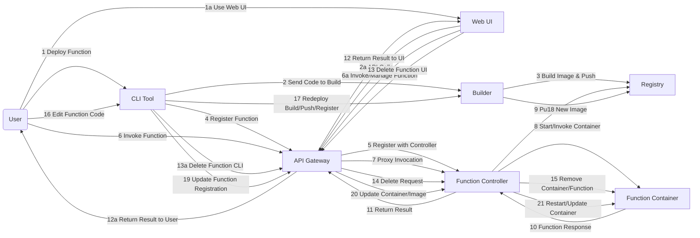

# Serverless Platform Documentation

## Overview

This project implements a modular, containerized serverless platform for deploying and managing serverless functions. It is designed for local development and experimentation, with clear separation of concerns between components and extensibility in mind.

---

## Architecture

The platform consists of the following core services, each running as a Docker container:

- **API Gateway**: Handles authentication, function registration, and invocation routing.
- **Function Controller**: Manages function containers (start/stop/invoke), proxies requests to them.
- **Builder**: Builds Docker images for functions and pushes them to a local registry.
- **Registry**: Stores Docker images for functions.
- **Metadata Service**: (Optional) Stores and retrieves function metadata.
- **CLI**: Command-line tool for initializing, deploying, and invoking functions.

All services communicate over a Docker bridge network, and the system is orchestrated using Docker Compose.

---

## Directory Structure

```plaintext
platform-repo/
├── api-gateway/
│   └── src/
│       └── server.go
├── builder/
│   └── src/
│       └── build.py
├── cli/
│   ├── my-function/
│   │   ├── app.py
│   │   ├── requirements.txt
│   │   └── function.json
│   └── src/
│       └── cli.js
├── function-controller/
│   └── src/
│       └── controller.go
├── metadata-service/
│   └── src/
│       └── app.py
├── platform-ui/
│   ├── public/
│   └── src/
│       ├── components/
│       └── pages/
├── runtimes/
│   └── python-flask/
│       └── Dockerfile
├── docker-compose.yaml
```

---

## User Flow Diagram



*This updated flow shows both CLI and Web UI as user entry points, and now includes flows for deleting a function/container and editing/redeploying a function. Deletion flows from UI/CLI through API Gateway to Function Controller and container removal. Editing and redeploying involves code changes, build, push, re-register, and updating the running container.*

---

## Frontend & Recent Feature Updates

### 1. Web UI (`platform-ui`)

- **Tech Stack:** React (with MUI), communicates with API Gateway via REST.
- **Features:**
  - Dashboard for listing, deploying, and managing functions
  - Real-time status display with pulsing/animated indicators
  - Start/stop/invoke functions with optimistic UI updates
  - Error handling and user feedback
  - Loading states and disabled actions during operations
- **Architecture:**
  - Talks to API Gateway for all operations (never directly to function containers)
  - Auto-refresh and delayed refresh to ensure accurate status
  - CORS handled via backend middleware
- **Recent Improvements:**
  - Accurate function status: Backend verifies container state using Docker and direct invocation checks
  - Robust container management: Supervisor, Gunicorn, and health checks keep containers alive
  - CORS middleware on all services for seamless UI/API integration
  - Enhanced error handling, logging, and UI responsiveness

### 2. Recent Backend Improvements

- **Function Controller:**
  - Uses `docker inspect` and health checks for true container status
  - Improved port allocation and error handling
  - Logs and updates state when containers are externally stopped
- **Builder & Metadata:**
  - CORS support
  - Improved error reporting
- **General:**
  - All services orchestrated via Docker Compose
  - Security recommendations for production (OAuth2/JWT, HTTPS)

---

## Component Details

### 1. API Gateway

- **Responsibilities**:

  - Authenticates requests (Bearer token)
  - Handles `/function/{name}` invocations
  - Registers new functions
  - Forwards requests to the Function Controller
- **Configurable via**: `CONTROLLER_URL` environment variable

---

### 2. Function Controller

- **Responsibilities**:
  - Registers functions and manages their state (in-memory)
  - Starts function containers on demand
  - Proxies invocation requests to running containers (using `host.docker.internal` for host access)
  - Handles `/register` and `/invoke/{name}` endpoints

---

### 3. Builder

- **Responsibilities**:
  - Accepts zipped function code from the CLI
  - Builds Docker images using the host Docker socket
  - Pushes images to the local registry (`localhost:5001`)
  - Returns image name for registration

---

### 4. Registry

- **Responsibilities**:
  - Stores and serves Docker images for functions
  - Exposed on `localhost:5001`

---

### 5. Metadata Service (Optional)

- **Responsibilities**:
  - Stores function metadata (name, endpoint, etc.)
  - Can be extended for more advanced use cases

---

### 6. CLI

- **Responsibilities**:
  - Initializes new function projects
  - Packages and deploys function code
  - Registers functions with API Gateway and Function Controller
  - Invokes functions
  - Handles authentication via token

---

## Environment Variables

- `AUTH_TOKEN`: Bearer token for authentication
- `API_URL`: Base URL for the API Gateway (default: `http://localhost:8080`)
- `BUILDER_URL`: Base URL for the Builder service (default: `http://localhost:8082`)
- `CONTROLLER_URL`: URL for the Function Controller (default: `http://function-controller:8081`)

---

## Quick Start

1. **Start the platform:**

   ```sh
   docker compose up --build
   ```
2. **Initialize a new function:**

   ```sh
   cd platform-repo/cli
   plat init --runtime python-flask
   ```
3. **Deploy the function:**

   ```sh
   cd my-function
   plat deploy
   ```
4. **Invoke the function:**

   ```sh
   curl -H "Authorization: Bearer dev-token" http://localhost:8080/function/my-function
   ```

---

## Dependency Management

- **Python Functions**: Specify dependencies in `requirements.txt` (see compatibility notes for Flask and Werkzeug).
- **Builder**: Uses host Docker socket for building images.
- **CLI**: Uses Node.js and Axios for HTTP requests.

---

## Security

- Simple Bearer token authentication is implemented for API Gateway and Function Controller.
- For production, consider integrating OAuth2/JWT and HTTPS.

---

## Recommendations for Production

- Replace in-memory registries with persistent storage (e.g., Redis, Postgres).
- Use a sandboxed build environment (e.g., Kaniko) instead of host Docker socket.
- Add logging, monitoring, and error reporting.
- Implement scaling and garbage collection for function containers.
- Use direct container networking for function invocation (instead of `host.docker.internal`).

---

## Troubleshooting

- **Function not found**: Ensure the function is registered with both the API Gateway and Function Controller.
- **Dependency errors**: Check `requirements.txt` for compatible versions.
- **Container connection refused**: Verify the container is running and accessible; check logs for errors.

---

## Extending the Platform

- **Add new runtimes**: Create a new directory in `runtimes/` with a custom Dockerfile.
- **Add features to CLI**: Implement commands for logs, metrics, scaling, etc.
- **Integrate with cloud**: Use managed registries, databases, and authentication providers.

---

## License

This project is open source and available for educational and prototyping purposes.
