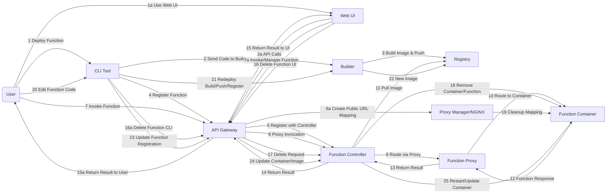

# Serverless Platform Documentation

## Overview

This platform is a modular, containerized serverless system for deploying and managing serverless functions, designed for local development with production-grade patterns. It now features AWS Lambda-style internal routing (no host port binding) and dynamic custom domain/public URL mapping for each project/service.

---

## Architecture

The platform consists of the following core services, each as a Docker container:

- **API Gateway**: Handles authentication, function registration, and invocation routing.
- **Function Controller**: Manages function containers (start/stop/invoke), proxies requests, and persists the function registry.
- **Function Proxy**: Internal Go-based reverse proxy that dynamically discovers function containers using Docker labels and routes requests using Docker internal DNS.
- **Builder**: Builds Docker images for functions and pushes them to a local registry.
- **Registry**: Stores Docker images for functions.
- **Metadata Service**: (Optional) Stores and retrieves function metadata.
- **Proxy Manager (Traefik)**: Provides dynamic public URL mapping for projects and services, mapping subdomains to containers.
- **CLI**: Command-line tool for initializing, deploying, and invoking functions.
- **Platform UI**: React-based dashboard for managing functions and projects.

All services communicate over Docker Compose-managed networks. Function containers are never exposed on host ports; all routing is internal.

---

## Key Features

- **Lambda-Style Internal Routing**: No function container exposes a port to the host. All invocation is routed through the internal proxy and Docker DNS, preventing port exhaustion and improving security.
- **Dynamic Public URL Mapping**: Each project/service is assigned a custom subdomain (e.g., `project-service.platform.test`). NGINX reverse proxy dynamically maps these to the correct containers. The orchestrator manages subdomain assignment and cleanup.
- **Docker Label-Based Discovery**: Function containers are labeled for dynamic discovery by the proxy, enabling automatic routing and management.
- **Persistent Function Registry**: Function metadata and state are persisted to disk and restored on restart, ensuring reliability.
- **Robust Container Management**: Supervisor, Gunicorn, and health checks keep function containers alive. Restart policies and detailed logging improve reliability.
- **CORS Support**: All services include CORS middleware for smooth UI/API integration.
- **UI/UX Improvements**: Real-time status, optimistic updates, loading indicators, and error handling in the dashboard.

---

## Directory Structure

```plaintext
platform-repository/
├── api-gateway/
│   └── src/
├── builder/
│   └── src/
├── cli/
├── docs/
├── function-controller/
│   └── src/
├── function-proxy/
│   └── src/
├── metadata-service/
│   └── src/
├── platform-ui/
│   ├── public/
│   └── src/
├── proxy/
│   └── src/
├── runtimes/
├── docker-compose.yaml
```

---

## User Flow Diagram



---

## Component Details

### API Gateway

- Authenticates requests (Bearer token)
- Handles function registration and invocation
- Forwards all function operations to the Function Controller
- Forwards requests to the Proxy Manager for public URL mapping

### Function Controller

- Manages function lifecycle: create, start, stop, delete, list
- Starts containers with Docker labels for discovery
- Persists function registry to disk for durability
- Verifies container status using Docker APIs and health checks
- Handles all function invocations via the Function Proxy (internal routing)

### Function Proxy

- Discovers function containers using Docker labels
- Maintains a routing table mapping function names to containers
- Routes invocation requests internally via Docker DNS (never exposes host ports)
- Handles timeouts and chained requests for cold starts

### Proxy Manager (NGINX)

- Dynamically configures NGINX to map subdomains to containers
- Assigns unique subdomains to each project/service (e.g., `project-service.platform.test`)
- Cleans up mappings when projects/services are deleted

### Builder

- Accepts zipped function code
- Builds Docker images and pushes to the local registry
- Returns image name for registration

### Registry

- Stores and serves Docker images for functions

### Metadata Service (Under Dev)

- Stores function metadata (name, endpoint, etc.)

### CLI

- Initializes new function projects
- Packages and deploys code
- Registers functions and manages deployments
- Invokes functions and handles authentication

### Platform UI

- React + MUI dashboard for managing functions and projects
- Lists, deploys, starts/stops, and invokes functions
- Shows real-time status with animated indicators
- Handles errors and loading states
- All interactions go through the API Gateway (never directly to containers)

---

## Networking & Security

- All services and function containers are connected via Docker Compose-managed networks
- No function container exposes a port to the host; all routing is internal
- NGINX reverse proxy provides public URL mapping for projects/services
- Security best practices: OAuth2/JWT for authentication, HTTPS recommended for production

---

## Environment Variables

- `AUTH_TOKEN`: Bearer token for authentication
- `API_URL`: Base URL for the API Gateway
- `BUILDER_URL`: Base URL for the Builder service
- `CONTROLLER_URL`: URL for the Function Controller
- `PROXY_URL`: URL for the Function Proxy

---

## Recent Improvements (April 2025)

- Lambda-style internal routing: No host port binding, all requests routed internally
- Dynamic public URL mapping with NGINX
- Docker label-based function discovery and routing
- Persistent function registry for reliability
- Robust container management and health checks
- UI/UX improvements for real-time feedback and error handling
- CORS support across all services

---

## Troubleshooting & Notes

- Ensure Docker Compose networks are consistent and use the correct prefixed names
- Check NGINX and proxy logs for routing issues
- Function registry is persisted at `/app/data/functions.json` in the Function Controller
- For Flask runtimes, ensure Gunicorn and Supervisor are used for reliability
- For custom domains, update your local DNS to resolve `.platform.test` as needed

---

For more details or advanced configuration, see the README files in each service directory.

---

## Quick Start

1. **Start the platform:**

   ```sh
   docker compose up --build
   ```
2. **Initialize a new function:**

   ```sh
   cd platform-repo/cli
   plat init --runtime python-flask
   ```
3. **Deploy the function:**

   ```sh
   cd my-function
   plat deploy
   ```
4. **Invoke the function:**

   ```sh
   curl -H "Authorization: Bearer dev-token" http://localhost:8080/function/my-function
   ```

---

## Dependency Management

- **Python Functions**: Specify dependencies in `requirements.txt` (see compatibility notes for Flask and Werkzeug).
- **Builder**: Uses host Docker socket for building images.
- **CLI**: Uses Node.js and Axios for HTTP requests.

---

## Security

- Simple Bearer token authentication is implemented for API Gateway and Function Controller.
- For production, consider integrating OAuth2/JWT and HTTPS.

---

## Recommendations for Production

- Replace in-memory registries with persistent storage (e.g., Redis, Postgres).
- Use a sandboxed build environment (e.g., Kaniko) instead of host Docker socket.
- Add logging, monitoring, and error reporting.
- Implement scaling and garbage collection for function containers.
- Use direct container networking for function invocation (instead of `host.docker.internal`).

---

## Troubleshooting

- **Function not found**: Ensure the function is registered with both the API Gateway and Function Controller.
- **Dependency errors**: Check `requirements.txt` for compatible versions.
- **Container connection refused**: Verify the container is running and accessible; check logs for errors.

---

## Extending the Platform

- **Add new runtimes**: Create a new directory in `runtimes/` with a custom Dockerfile.
- **Add features to CLI**: Implement commands for logs, metrics, scaling, etc.
- **Integrate with cloud**: Use managed registries, databases, and authentication providers.

---

## License

This project is open source and available for educational and prototyping purposes.
