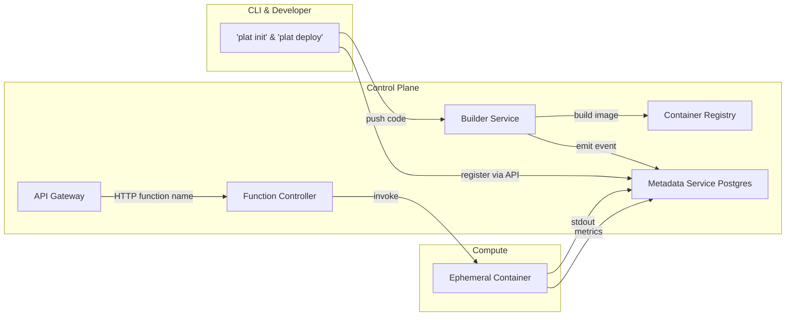

## MVP Project Plan: Prototype Serverless Platform

### 1. Roadmap Alignment

This plan is based on the provided project ROADMAP:

| Phase | Focus                                      | Key Additions                                |
| ----- | ------------------------------------------ | -------------------------------------------- |
| MVP   | “Hello‑World” HTTP functions            | Basic auth, single region, manual scaling    |
| v1    | Multi‑tenant isolation, secrets injection | Per‑tenant namespaces, Vault integration    |
| v2    | Auto‑scaling & pools                      | Warm pool manager, horizontal pod autoscaler |
| v3    | Observability & SLA                        | Distributed tracing (OpenTelemetry), SLIs    |
| v4    | CI/CD & Preview Envs                       | Git Webhooks → auto‑build & ephemeral URLs |
| v5    | Advanced security & compliance             | FIPS containers, VPC peering, audit logs     |

---

### 2. Overview & 1‑Week Intensive Schedule

 **Objective** : Build a minimal viable FaaS prototype with HTTP-triggered functions, basic auth, and single-region deployment—all within 5 business days.

| Day   | Focus                                      | Deliverables                                 |
| ----- | ------------------------------------------ | -------------------------------------------- |
| Day 1 | Scaffolding & CLI +`plat init`+ examples | Monorepo initialized; CLI `init`working    |
| Day 2 | Builder Service & Registry Integration     | `builder/`service; Kaniko builds images    |
| Day 3 | API Gateway + Function Controller          | Go proxy; controller logic + Docker spin-up  |
| Day 4 | Observability & Local Dev Compose          | Logging+Metrics; single‑node Docker Compose |
| Day 5 | Integration, Testing & Documentation       | End‑to‑end test; Quickstart guide; cleanup |

---

### 3. Architecture Diagram (MVP)



---

### 4. Day 1: Scaffolding & CLI

 **Goals** : Initialize monorepo, define `runtime.yaml`, implement `plat init`, validate examples.

#### Tasks

1. Monorepo setup (root scaffold)
2. Define `runtime.yaml` schema
3. Implement `plat init` in `cli/src/cli.js`
4. Populate `examples/` and test `plat init`
5. Unit tests for CLI (Jest)

#### Directory Structure (After Day 1)

```
/                                   # root
├── cli/                            # Developer CLI
│   └── src/cli.js
├── runtimes/                       # Runtime templates
├── examples/                       # Sample apps
├── common/                         # Shared configs/utilities
├── docs/                           # Initial docs
└── README.md                       # Getting started guide
```

---

### 5. Day 2: Builder Service & Registry

 **Goals** : Auto-detect runtime, build container images with Kaniko, push to registry, register metadata.

#### Tasks

1. Implement `builder/src/build.py` for detection & Kaniko build
2. Containerize builder (Dockerfile with Kaniko)
3. Stand up local registry (Harbor/Docker Registry)
4. Call Metadata Service API to record function metadata

#### Directory Structure (After Day 2)

```
/                                   # root
├── builder/                        # Build service
│   ├── src/build.py               # Runtime detection & build logic
│   └── Dockerfile                 # Kaniko executor image
├── infra/ansible/                 # Host bootstrap scripts
└── registry/                       # Local container registry config
```

---

### 6. Day 3: API Gateway & Function Controller

 **Goals** : Route HTTP through Go API Gateway into the Function Controller; spin up containers on demand.

#### Tasks

1. API Gateway (`api-gateway/src/server.go`) proxy with basic auth
2. Function Controller (`function-controller/src/controller.go`): warm-pool check, Docker SDK spin-up
3. Docker-in-Docker orchestration on single VM
4. Health endpoints and basic error handling

#### Directory Structure (After Day 3)

```
/                                   # root
├── api-gateway/                    # HTTP entrypoint service
│   └── src/server.go
├── function-controller/            # Invocation manager
│   └── src/controller.go
├── infra/docker-compose.yaml       # DIND for gateway/controller
└── metadata-service/               # Postgres metadata API
```

---

### 7. Day 4: Observability & Local Dev Compose

 **Goals** : Capture logs, expose Prometheus metrics, spin up full stack locally via Docker Compose.

#### Tasks

1. Logging: redirect container stdout/stderr to files or SQLite
2. Metrics: instrument builder, controller with Prometheus client
3. Docker Compose for local: Postgres, registry, metadata, gateway, controller, builder
4. Add `/health` endpoints and readiness probes

#### Directory Structure (After Day 4)

```
/                                   # root
├── docker-compose.yaml             # Local dev orchestration
├── monitoring/                     # Observability configs
│   ├── prometheus/                 # metrics config
│   └── grafana/                    # dashboards (optional)
├── metadata-service/               # CRUD API
├── api-gateway/                    # HTTP gateway
├── function-controller/            # Invocation logic
└── builder/                        # Build service
```

---

### 8. Day 5: Integration, Testing & Documentation

 **Goals** : Validate end-to-end, write Quickstart guide, polish and cleanup.

#### Tasks

1. End-to-end test: `hello-world` function deploy & invoke
2. Unit/integration tests for builder, CLI, controller
3. Quickstart tutorial in `docs/architecture.md`
4. Final cleanup: docs, error handling, minor bug fixes

#### Directory Structure (Final)

```
/                                   # root
├── cli/                            # Developer CLI
├── runtimes/                       # User runtime templates
├── examples/                       # Sample apps
├── builder/                        # Build service
├── api-gateway/                    # HTTP gateway
├── function-controller/            # Invocation logic
├── metadata-service/               # Metadata API
├── infra/                          # IaC & bootstrap
├── monitoring/                     # Logging & metrics
├── docs/                           # Architecture & tutorials
└── docker-compose.yaml             # Local dev env
```

---

### 9. Risks & Mitigations

* **Cold starts** : maintain a minimal warm-pool (size = 1)
* **Security** : isolate Docker socket via user namespaces
* **Time constraint** : daily syncs and clear acceptance criteria

---

### 10. Next Steps Post-MVP

* Multi-node orchestration (Nomad/K8s)
* Event triggers (queues, cron jobs)
* Secrets injection (Vault)
* Multi-region HA
