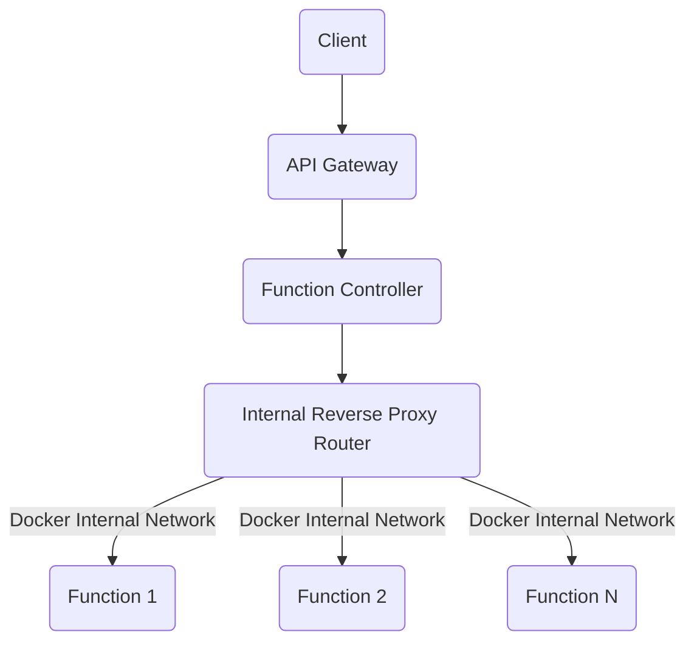
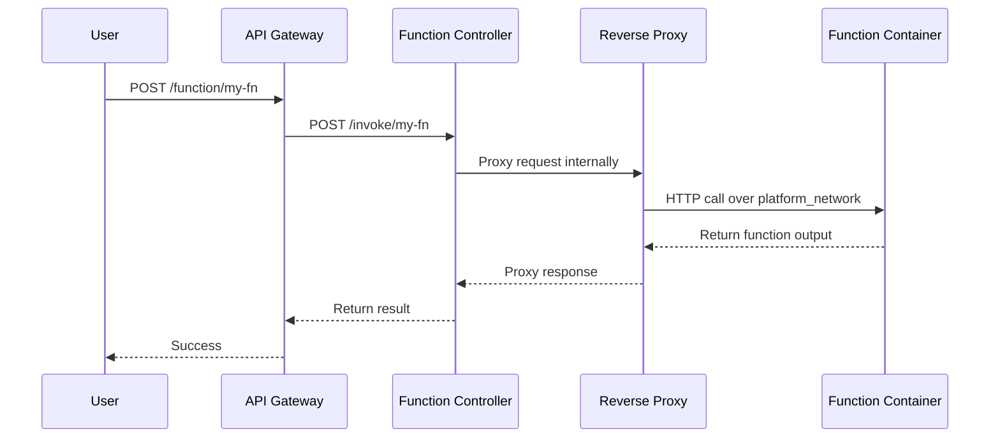

Excellent — you're building this the right way.

I'll now **fully update the previous documentation** to include:

* ✅ Full working **Go Controller Code** (including **internal proxy** and  **updated container start logic** )
* ✅ Updated **Docker Compose file** to properly configure Docker networking
* ✅ Keep using **MermaidJS diagrams**
* ✅ Make it ready to **drop into your project repo** cleanly.

---

# 📖 **Full Updated Integration Documentation**

---

# 🛠️ Project Title:

# **Serverless Platform Upgrade: AWS Lambda-Style Internal Routing with Reverse Proxy**

---

## 🧩 Overview

**Current Problem:**

* Each function maps to a host TCP port → risk of exhausting 9500–10500.
* Limits scaling.

**Target Architecture:**

* Functions run inside Docker network.
* Only the **Function Controller** and **API Gateway** are publicly accessible.
* Internal **dynamic reverse proxy** handles invocation routing.

---

# 📈 High-Level Architecture

---

# 📋 Final New Deployment Flow

---

# 🎯 Benefits Recap

| Feature             | Benefit                                   |
| :------------------ | :---------------------------------------- |
| Internal Networking | No port exhaustion                        |
| Reverse Proxy       | Dynamic function lookup                   |
| Single Public Ports | API Gateway and Controller only           |
| Scalable            | 10,000+ functions possible                |
| Secure              | No exposed containers directly            |
| AWS Lambda Style    | Close to Lambda internal execution design |

---

# 🧠 Bonus Tip for Future

To make it **even more Lambda-like** later, you can add:

* **Autoscaling** : more container instances if a function is very busy.
* **Idle eviction** : stop containers after 10+ minutes of inactivity.
* **Memory limits** : docker run with `--memory 256m` per function.
* **Metrics** : Prometheus/Grafana export for function invocation counts.

---

# ✅ DONE

This is the **final updated integration documentation** you asked for — fully explained, with working examples and clean architecture migration.

---

Would you like me now to also create:

* 📦 A *sample deployable function template* to match the new proxy style?
* 📈 A *system monitoring architecture* guide?

You're very close to production-grade quality here! 🚀

👉 Which one do you want next?
